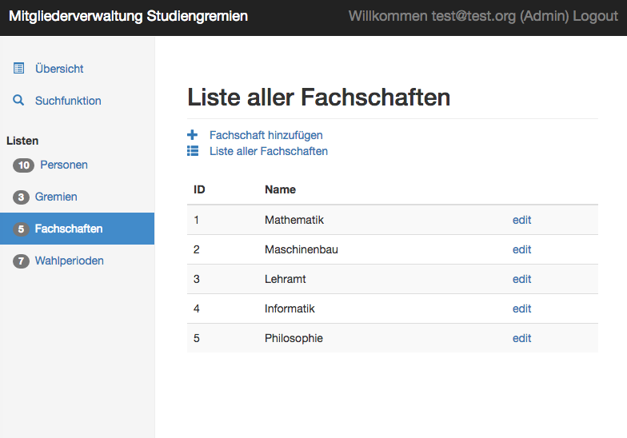

SS 2016
TU Chemnitz
Praxisprojekt Datenbanken & Webtechniken
====================

This project uses mainly HTML, jQuery, Bootstrap and PHP.
The data is queried from a PostgreSQL database.
In order to run the application a webserver with PHP and the PostgreSQL modules is needed.
After that simply click on the index-page located at /src/index.html.

